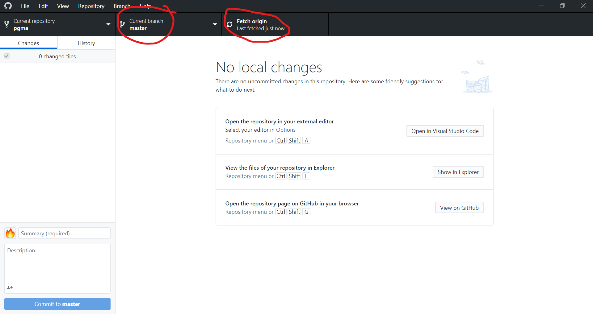
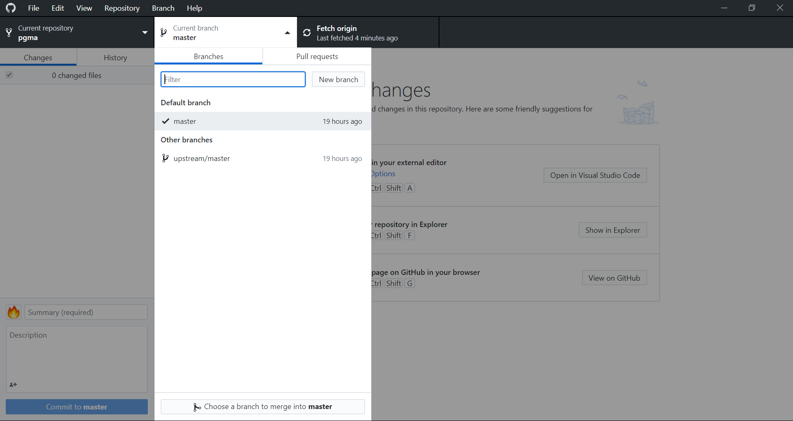

# Contributing

So, you want to help the project out. That's great but there is a certain way to make sure that your changes are accepted by the maintainers.

## Prerequisites

You will need a Git client, I recommend [Github Desktop](https://desktop.github.com), and you will need a text editor. I strongly recommend [Visual Studio Code](https://code.visualstudio.com), as it supports syntax highlighting and it helps troubleshoot Git problems.

## Overview

Let's start by defining a few terms specific to Git.

> **Git** is a version control system (VCS.) This allows anyone to make changes to and view all previous changes of a project. This makes for easy troubleshooting.
### 

> A **Repository** is a Git project. This whole project is one repository, even though there are many folders.

> **Forking** a repository is when you *make an identical copy* of a repository. **THIS INCLUDES THE MASTER BRANCH**. However, this does not sync your changes with the *upstream repository* (aka this repo.) You can set this up in Github Desktop by following this guide.

> **Cloning** a repository is when you make a local copy of either your or someone elses repository. If you intend to submit changes to this repository, you must **fork**, clone **the fork**, and sync with the upstream

## Getting Started

Fork this repository by logging into your GitHub account. Then, click the fork button.

Wait, and you will be brought to your own copy of this repository. Open Github Desktop and sign-in if required.

You will be brought to the main page of Github Desktop. Click your fork in the list of your repositories. Click 'clone'

## Syncing Your Fork
This next section describes how to keep your fork's master branch synced with the master branch of the 'upstream repository.' This eliminates incompatibilities and makes merging pull requests 100x easier.

First, be sure that the current branch is set to *master*,**not upstream/master or dev, etc.** Next, press the fetch origin button. Then click the *current branch* button.

Select the *choose a branch to merge into master* button at the bottom. Select *upstream/master* and select **Merge** if Git detects that your fork is out of date.  

You will need to do this every time there is a new commit to the *upstream* master branch

## Making Changes

If you have VS Code as your editor, simpily push the **Open in Visual Studio Code** button.

